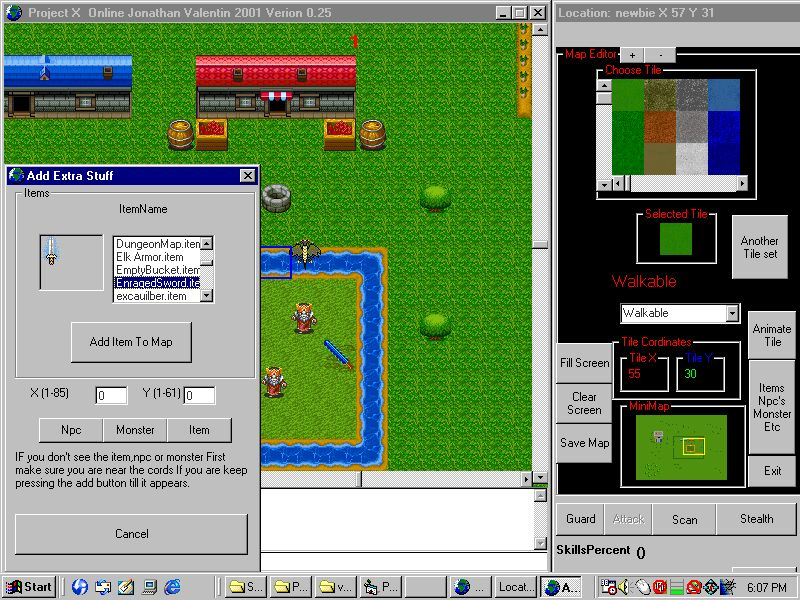

<div align="center">

## Project X Online


</div>

### Description

This is a full rpg engine. I have been working on this for over a year. I have made over 100 maps for this release which means a huge world to explore. Features are night and day, monsters ,npcs, items with the abiltiy to drop

and pick items up. Random world generator so the game never ends. The engine also features a quest maker. Built in map editor, offline and online play. Tons of features to many to mention them all. Just check this sample out.

For someone reason pscode would not upload it so it is at

http://www.projectxonline.net/downloads/Project X Online Source.zip
 
### More Info
 
Before you run the game you need to make sure actskin4.ocx is registered


<span>             |<span>
---                |---
**Submitted On**   |
**By**             |[vbgamer45](https://github.com/Planet-Source-Code/PSCIndex/blob/master/ByAuthor/vbgamer45.md)
**Level**          |Intermediate
**User Rating**    |4.8 (19 globes from 4 users)
**Compatibility**  |VB 5\.0, VB 6\.0
**Category**       |[Games](https://github.com/Planet-Source-Code/PSCIndex/blob/master/ByCategory/games__1-38.md)
**World**          |[Visual Basic](https://github.com/Planet-Source-Code/PSCIndex/blob/master/ByWorld/visual-basic.md)
**Archive File**   |[](https://github.com/Planet-Source-Code/vbgamer45-project-x-online__1-40224/archive/master.zip)


### Source Code

```
Due to pscode would not upload it
http://www.projectxonline.net/downloads/Project X Online Source.zip
```

